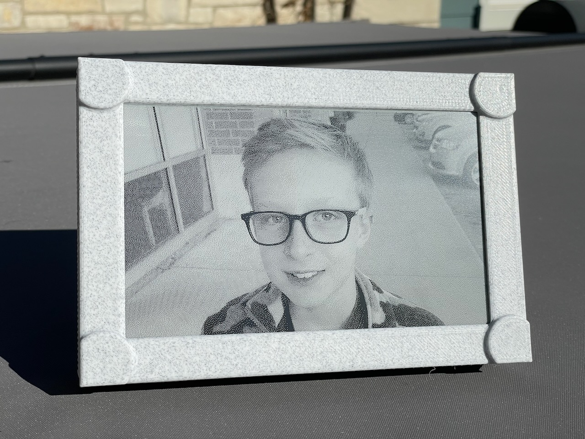
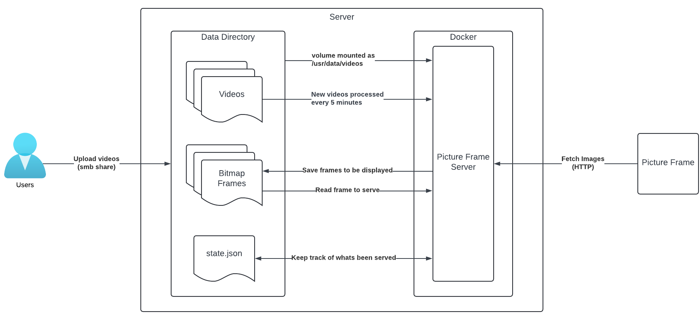

# Description

This project plays home videos at a very low framerate on a battery-powered [ePaper display](https://en.wikipedia.org/wiki/Electronic_paper).  By default one frame is shown every two minutes.  These displays only require power to change what is being shown, so after drawing a frame the device goes into deep sleep until its time to show the next frame.  

Images are fetched from an HTTP endpoint.  Onboard flash storage is used to cache multiple images to limit usage of WiFi.  The microcontroller I am using can fit 56 images in cache.  With the default of showing one frame every two minutes that means new images are fetched roughly every two hours.

The display I am using has a resolution of 800x480.  While it technically can show four colors (black, dark grey, light grey, white), in practice I found that caused severe ghosting.  Therefore I am sticking to purely black and white images.  Bitmaps are used for simplicity.  Only one bit is needed per pixel, so the resulting pictures are exactly 48 KB ( &nbsp;  &nbsp; (800 x 480) / 8 &nbsp;  &nbsp; ).  The server creates these bitmap frames automatically from source videos.  It uses [Floyd–Steinberg dithering](https://en.wikipedia.org/wiki/Floyd–Steinberg_dithering) to create convincing greyscale images.

The server needs access to a directory to source videos from, storage bitmap frames, and persist state.  Users will need access to that directory, perhaps as a SMB share, to upload videos.  The server is designed to support multiple displays.  Each will have a directory with a name like "display1", "display2", etc.  You'll need to create this initial directory.  The diagram below assumes you are running the server as a docker container and volume mounting the directory as /usr/data/videos. 

The server checks the data directory every 5 minutes.  If any new videos are found in a display directory (e.g. "display1") it will process them to create the necessary bitmap frames.  It assumes videos are in landscape orientation.  It will scale and crop them down to 800x480, reduce the framerate to 15 fps, dither each frame, and convert each frame to a one-bit bitmap.  While a video is being processed it will create a "temp" directory at the root of the data directory.  When processing is completed the directory with the bitmap frames will be moved to the appropriate display directory, and "temp" will be deleted.  Only one video will be processed at a time.  Once a couple videos have been processed the directory tree will look like:

* Data
  * display1
    * Family Vid 1_bitmap_frames/
    * Family Vid 1.mkv
    * Baby First Steps_bitmap_frames/
    * Baby First Steps.mov

[FFmpeg](https://ffmpeg.org) is used to do the initial video conversion.  Any file format they support should work.

A state.json file will be created in each display directory.  This is used to keep track of the last directory/frame that was served.  

The HTTP endpoint takes a single query string parameter, displayId.  This needs to match the display directory in the data folder.  

`http://192.168.1.2:8080/image?displayId=1`

Everytime the HTTP endpoint is called it serves the next frame.  Once the last frame is reached it moves to the next directory in alphabetical order and starts with the first frame.  After the final frame of the final directory is shown it resets to the first frame of the first directory.  If you want to change what video or frame is being shown yourself feel free to modify state.json.  Keep in mind however that the picture frame will only fetch new images once its cache has emptied, so it may be a couple hours until you see your changes.

## High Level Architecture

# Parts Needed
* [7.5 inch e-ink screen 800x480 electronic paper display (GDEY075T7)](https://www.good-display.com/product/396.html)
  * I am using the [GxEPD2 library](https://github.com/ZinggJM/GxEPD2), so any display they support should work.  You'd need to change GxEPD2_DRIVER_CLASS in DisplayController.cpp.  If you're getting away from an 800x480 display you'd need to change several other parts of this project that I am not going to fully detail here, but it shouldn't be that difficult.
* [ePaper screen adapter board (DESPI-C02)](https://www.good-display.com/product/516.html)
  * This was included with the display when I bought it on AliExpress.
* [ESP32C3 Microcontroller](https://wiki.luatos.org/chips/esp32c3/board.html) ([Amazon Link](https://www.amazon.com/dp/B0BWN14X65))
* [3D-Printed Picture Frame](https://www.printables.com/model/834813-electronic-paper-picture-frame-75-inch)
* 18650 Battery
* [Battery Contacts](https://www.amazon.com/10Pairs-Battery-Negative-Positive-Conversion/dp/B09DSQL56P/)
* [DC-DC Step-Down Buck Converter (LM2596S)](https://www.aliexpress.us/item/3256806282089502.html)
  * Set this to 3.3V
* [Lithium Battery Charger and Protection Module (TP4056)](https://www.aliexpress.us/item/3256805893091274.html)
* [Self-Locking Push Button (1208YD, WBK-1208)](https://www.amazon.com/gp/product/B086L3J1Z6)
* M3xL4xOD5 threaded inserts (19 total)
* M3x6 screws (19 total)

# Setting Up
## Picture Frame
* Open the MicroControllerCode.ino project in [Arduino IDE](https://www.arduino.cc/en/software).
* Modify Config.h to set:
  * `ssid` = name of your wifi
  * `password` = password of your wifi
  * `httpEndpoint` = HTTP endpoint of the server
  * If necessary, change the GPIO pin assignments
  * `deepSleepTime` is how long a frame will be shown, in microseconds.  By default its two minutes.  

# Known Bugs
* Images occaisionally fail to write on the microcontroller.  I don't know what is causing this, but when it is detected I'm just reformatting the storage and fetching from scratch. 
* After all images are fetched when it redraws the area where the messages show up it uses pixels values from the most recent image as opposed to the image that was on screen before the images started being fetched.

# Additional Links
[picture-frame-server](https://hub.docker.com/repository/docker/thompatterson/picture-frame-server/general) on DockerHub.